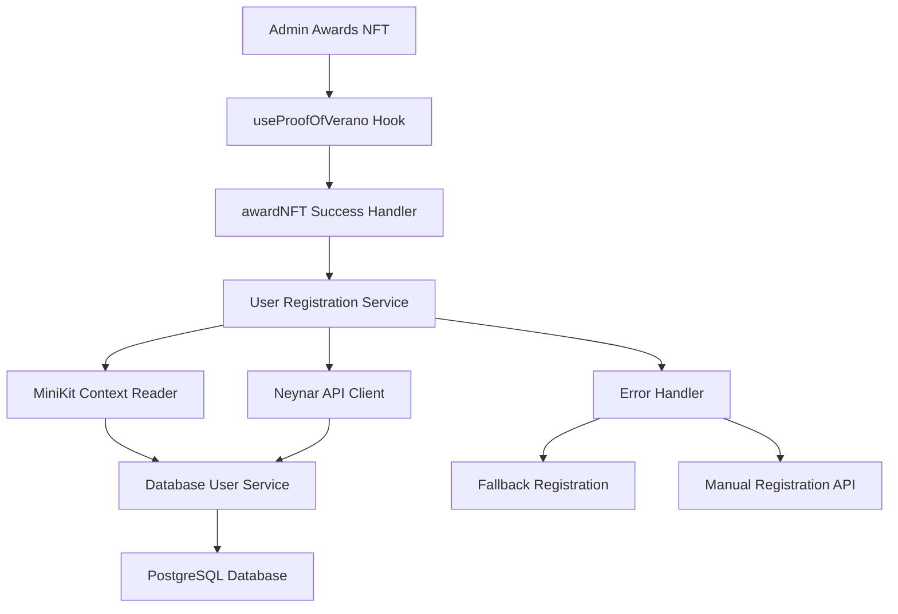

# Implementation Plan: Database User Registration on NFT Award

**Version**: 1.0  
**Date**: January 28, 2025  
**Status**: Ready for Implementation  
**Priority**: High  

## 📋 Overview

Implement automatic database user registration when bootcamp graduates receive their NFT certificate, capturing comprehensive Farcaster profile data via MiniKit and enriching it with Neynar API integration.

### Current System Analysis

**Existing Flow:**
1. User registers wallet address in ProofOfVerano smart contract
2. Admin awards NFT via `awardNFT` function  
3. **Gap**: No database registration occurs

**Integration Points:**
- **MiniKit Context**: Provides basic Farcaster data (fid, username, displayName, pfpUrl)
- **Smart Contract**: `awardNFT` success trigger in `useProofOfVerano` hook
- **Database**: Existing User model with PostgreSQL backend
- **Neynar API**: Additional profile enrichment capabilities

## 🎯 Goals & Requirements

### Primary Goals
- ✅ Automatic user registration when NFT is awarded
- ✅ Capture Farcaster profile data from MiniKit
- ✅ Enrich profile with Neynar API data
- ✅ Link wallet addresses to Farcaster profiles  
- ✅ Maintain data consistency and error handling

### Technical Requirements
- **Performance**: Database writes within 2 seconds of NFT award
- **Reliability**: 95% success rate with fallback mechanisms
- **Data Quality**: Comprehensive profile capture with validation
- **Security**: Secure API key management and data sanitization

## 🗄️ Database Schema Design

### Updated User Model Extensions

```prisma
model User {
  // Existing fields...
  id                 String         @id @default(uuid())
  appWallet          String?        @unique
  username           String?        @unique
  displayName        String?
  email              String?        @unique
  bio                String?
  website            String?
  avatarUrl          String?
  bannerUrl          String?
  metadata           String?
  createdAt          DateTime       @default(now())
  updatedAt          DateTime       @updatedAt

  // New Farcaster Integration Fields
  farcasterId        String?        @unique         // fid from Farcaster
  farcasterUsername  String?        @unique         // fname from Farcaster  
  farcasterCustody   String?                        // custody address
  farcasterVerified  Boolean        @default(false) // verification status
  followerCount      Int?                           // follower count from Neynar
  followingCount     Int?                           // following count from Neynar
  powerBadge         Boolean        @default(false) // Farcaster power badge
  verifiedAddresses  Json?                          // ETH/SOL addresses from Neynar
  
  // NFT Integration Fields  
  nftTokenId         String?                        // awarded NFT token ID
  bootcampCompleted  Boolean        @default(false) // completion status
  completionDate     DateTime?                      // NFT award date
  commitmentScore    Int?                           // score from smart contract

  // Existing relations...
  comments           Comment[]
  engagement         Engagement[]
  projects           Project[]
  // ... other relations

  @@index([farcasterId, farcasterUsername])
  @@index([appWallet, farcasterId])
  @@map("users")
}
```

### Migration Strategy
```sql
-- Add new columns to existing users table
ALTER TABLE users ADD COLUMN farcaster_id VARCHAR UNIQUE;
ALTER TABLE users ADD COLUMN farcaster_username VARCHAR UNIQUE;
ALTER TABLE users ADD COLUMN farcaster_custody VARCHAR;
ALTER TABLE users ADD COLUMN farcaster_verified BOOLEAN DEFAULT FALSE;
ALTER TABLE users ADD COLUMN follower_count INTEGER;
ALTER TABLE users ADD COLUMN following_count INTEGER;
ALTER TABLE users ADD COLUMN power_badge BOOLEAN DEFAULT FALSE;
ALTER TABLE users ADD COLUMN verified_addresses JSONB;
ALTER TABLE users ADD COLUMN nft_token_id VARCHAR;
ALTER TABLE users ADD COLUMN bootcamp_completed BOOLEAN DEFAULT FALSE;
ALTER TABLE users ADD COLUMN completion_date TIMESTAMP;
ALTER TABLE users ADD COLUMN commitment_score INTEGER;

-- Add indexes for performance
CREATE INDEX idx_users_farcaster_id ON users(farcaster_id);
CREATE INDEX idx_users_farcaster_username ON users(farcaster_username);
CREATE INDEX idx_users_app_wallet_farcaster ON users(app_wallet, farcaster_id);
```

## 🏗️ System Architecture

### Component Overview



### Data Flow Architecture

1. **Trigger Phase**: NFT award transaction confirms on blockchain
2. **Context Phase**: Extract Farcaster data from MiniKit context
3. **Enrichment Phase**: Fetch additional data from Neynar API
4. **Registration Phase**: Create/update user record in database
5. **Validation Phase**: Verify data integrity and completeness

## 📋 Implementation Plan

### Phase 1: Infrastructure Setup (2 hours)

#### 1.1 Environment & Dependencies (45 minutes)
```bash
# Install Neynar SDK
bun add @neynar/nodejs-sdk

# Add environment variables
echo "NEYNAR_API_KEY=your_neynar_api_key" >> .env.local
```

**Environment Variables Required:**
```env
# Neynar Integration
NEYNAR_API_KEY=your_neynar_api_key
NEYNAR_API_URL=https://api.neynar.com/v2

# Optional: Rate limiting
NEYNAR_RATE_LIMIT_PER_MINUTE=300
```

#### 1.2 Database Migration (30 minutes)
**File**: `prisma/migrations/xxx_add_farcaster_integration.sql`

```sql
-- Migration script with all new columns and indexes
-- (See Database Schema Design section above)
```

#### 1.3 Neynar API Client Setup (45 minutes)
**File**: `lib/clients/neynar-client.ts`

```typescript
import { NeynarAPIClient } from '@neynar/nodejs-sdk';

class NeynarClient {
  private client: NeynarAPIClient;
  
  constructor() {
    this.client = new NeynarAPIClient(
      process.env.NEYNAR_API_KEY!,
      { apiUrl: process.env.NEYNAR_API_URL }
    );
  }

  async getUserByFid(fid: number) {
    try {
      const response = await this.client.fetchBulkUsers([fid]);
      return response.users[0] || null;
    } catch (error) {
      console.error('Neynar API error:', error);
      return null;
    }
  }

  async getUserByWalletAddress(address: string) {
    try {
      const response = await this.client.fetchBulkUsersByEthOrSolAddress([address]);
      return response[address]?.[0] || null;
    } catch (error) {
      console.error('Neynar wallet lookup error:', error);
      return null;
    }
  }

  async enrichUserProfile(fid: number) {
    const user = await this.getUserByFid(fid);
    if (!user) return null;

    return {
      farcasterId: user.fid.toString(),
      farcasterUsername: user.username,
      displayName: user.display_name,
      bio: user.profile?.bio?.text,
      avatarUrl: user.pfp_url,
      farcasterCustody: user.custody_address,
      farcasterVerified: user.verified_addresses?.eth_addresses?.length > 0,
      followerCount: user.follower_count,
      followingCount: user.following_count,
      powerBadge: user.power_badge,
      verifiedAddresses: {
        eth: user.verified_addresses?.eth_addresses || [],
        sol: user.verified_addresses?.sol_addresses || []
      }
    };
  }
}

export const neynarClient = new NeynarClient();
```

### Phase 2: User Registration Service (2 hours)

#### 2.1 Core Registration Service (1.5 hours)
**File**: `lib/services/user-registration.ts`

```typescript
import { neynarClient } from '@/lib/clients/neynar-client';
import { userService } from '@/lib/db';
import type { FrameContext } from '@/app/types/minikit';

interface NFTAwardContext {
  walletAddress: string;
  tokenId: string;
  commitmentScore?: number;
  farcasterContext?: FrameContext;
}

export class UserRegistrationService {
  async registerUserOnNFTAward(context: NFTAwardContext) {
    const { walletAddress, tokenId, commitmentScore, farcasterContext } = context;
    
    try {
      // Step 1: Extract basic Farcaster data from MiniKit
      const basicFarcasterData = this.extractMiniKitData(farcasterContext);
      
      // Step 2: Enrich with Neynar API if FID available
      let enrichedData = null;
      if (basicFarcasterData?.fid) {
        enrichedData = await neynarClient.enrichUserProfile(basicFarcasterData.fid);
      }
      
      // Step 3: Prepare user data for database
      const userData = this.prepareUserData({
        walletAddress,
        tokenId,
        commitmentScore,
        basicData: basicFarcasterData,
        enrichedData
      });
      
      // Step 4: Create or update user record
      const user = await this.upsertUser(userData);
      
      console.log('User registration successful:', user.id);
      return user;
      
    } catch (error) {
      console.error('User registration failed:', error);
      
      // Fallback: Create minimal user record
      return await this.createFallbackUser(walletAddress, tokenId);
    }
  }

  private extractMiniKitData(context?: FrameContext) {
    if (!context?.user) return null;
    
    return {
      fid: context.user.fid,
      username: context.user.username,
      displayName: context.user.displayName,
      pfpUrl: context.user.pfpUrl
    };
  }

  private prepareUserData(data: any) {
    const { walletAddress, tokenId, commitmentScore, basicData, enrichedData } = data;
    
    return {
      appWallet: walletAddress,
      nftTokenId: tokenId,
      bootcampCompleted: true,
      completionDate: new Date(),
      commitmentScore,
      
      // Farcaster data (enriched takes priority)
      farcasterId: enrichedData?.farcasterId || basicData?.fid?.toString(),
      farcasterUsername: enrichedData?.farcasterUsername || basicData?.username,
      username: enrichedData?.farcasterUsername || basicData?.username,
      displayName: enrichedData?.displayName || basicData?.displayName,
      bio: enrichedData?.bio,
      avatarUrl: enrichedData?.avatarUrl || basicData?.pfpUrl,
      
      // Neynar-specific data
      farcasterCustody: enrichedData?.farcasterCustody,
      farcasterVerified: enrichedData?.farcasterVerified || false,
      followerCount: enrichedData?.followerCount,
      followingCount: enrichedData?.followingCount,
      powerBadge: enrichedData?.powerBadge || false,
      verifiedAddresses: enrichedData?.verifiedAddresses,
    };
  }

  private async upsertUser(userData: any) {
    // Try by wallet address first
    const existingUser = await userService.findByAppWallet(userData.appWallet);
    
    if (existingUser) {
      return await userService.updateUser(existingUser.id, userData);
    }
    
    // Try by Farcaster ID if available
    if (userData.farcasterId) {
      const farcasterUser = await userService.findByFarcasterId(userData.farcasterId);
      if (farcasterUser) {
        return await userService.updateUser(farcasterUser.id, userData);
      }
    }
    
    // Create new user
    return await userService.createUser(userData);
  }

  private async createFallbackUser(walletAddress: string, tokenId: string) {
    return await userService.createUser({
      appWallet: walletAddress,
      nftTokenId: tokenId,
      bootcampCompleted: true,
      completionDate: new Date(),
      username: `user_${walletAddress.slice(-8)}` // Generate basic username
    });
  }
}

export const userRegistrationService = new UserRegistrationService();
```

#### 2.2 Database Service Extensions (30 minutes)
**File**: `lib/db.ts` (extend existing userService)

```typescript
// Add new methods to existing userService
export const userService = {
  // ... existing methods

  async findByFarcasterId(farcasterId: string) {
    return prisma.user.findUnique({
      where: { farcasterId },
    });
  },

  async findByFarcasterUsername(farcasterUsername: string) {
    return prisma.user.findUnique({
      where: { farcasterUsername },
    });
  },

  async createUserWithFarcaster(data: {
    appWallet?: string;
    farcasterId?: string;
    farcasterUsername?: string;
    displayName?: string;
    bio?: string;
    avatarUrl?: string;
    nftTokenId?: string;
    bootcampCompleted?: boolean;
    completionDate?: Date;
    commitmentScore?: number;
    // ... other fields
  }) {
    return prisma.user.create({
      data,
    });
  },

  async updateUserFarcasterData(id: string, data: {
    farcasterId?: string;
    farcasterUsername?: string;
    farcasterCustody?: string;
    farcasterVerified?: boolean;
    followerCount?: number;
    followingCount?: number;
    powerBadge?: boolean;
    verifiedAddresses?: any;
  }) {
    return prisma.user.update({
      where: { id },
      data,
    });
  },
};
```

### Phase 3: Integration with NFT Award Flow (1.5 hours)

#### 3.1 Hook Integration (1 hour)
**File**: `lib/hooks/useProofOfVerano.ts` (modify existing hook)

```typescript
// Add to existing useProofOfVerano hook
import { userRegistrationService } from '@/lib/services/user-registration';
import { useFarcasterFrame } from '@/app/hooks/useFarcasterFrame';

export function useProofOfVerano() {
  // ... existing code
  const { frameInfo } = useFarcasterFrame();

  // Modify existing useEffect for award success
  useEffect(() => {
    const handleNFTAwardSuccess = async () => {
      if (isAwardSuccess && address) {
        try {
          // Trigger user registration
          await userRegistrationService.registerUserOnNFTAward({
            walletAddress: address,
            tokenId: awardHash || 'pending', // Use transaction hash as temp ID
            farcasterContext: frameInfo.context
          });
          
          console.log('User registration triggered successfully');
        } catch (error) {
          console.error('Failed to register user:', error);
          // Don't block the UI - registration happens in background
        }
      }
    };

    handleNFTAwardSuccess();
  }, [isAwardSuccess, address, awardHash, frameInfo.context]);

  // ... rest of existing hook
}
```

#### 3.2 Admin Panel Integration (30 minutes)
**File**: `app/verano/components/AdminPanel.tsx` (modify existing component)

```typescript
// Add to existing AdminPanel component
import { userRegistrationService } from '@/lib/services/user-registration';

export function AdminPanel() {
  // ... existing code
  
  const handleAwardNFT = async () => {
    // ... existing NFT award logic
    
    try {
      await awardNFT(selectedStudent.address as Address, tokenURI);
      
      // Trigger user registration after successful NFT award
      await userRegistrationService.registerUserOnNFTAward({
        walletAddress: selectedStudent.address,
        tokenId: 'manual_award', // Distinguish manual awards
        commitmentScore: selectedStudent.commitmentScore,
      });
      
      alert('NFT otorgado y usuario registrado exitosamente');
    } catch (error) {
      console.error('Error in NFT award process:', error);
      alert('Error al otorgar NFT');
    }
  };

  // ... rest of existing component
}
```

### Phase 4: API Endpoints (1 hour)

#### 4.1 Registration API Endpoint (30 minutes)
**File**: `app/api/users/register/route.ts`

```typescript
import { NextRequest, NextResponse } from 'next/server';
import { userRegistrationService } from '@/lib/services/user-registration';

export async function POST(req: NextRequest) {
  try {
    const body = await req.json();
    const { walletAddress, tokenId, commitmentScore, farcasterContext } = body;

    if (!walletAddress || !tokenId) {
      return NextResponse.json(
        { error: 'walletAddress and tokenId are required' },
        { status: 400 }
      );
    }

    const user = await userRegistrationService.registerUserOnNFTAward({
      walletAddress,
      tokenId,
      commitmentScore,
      farcasterContext
    });

    return NextResponse.json({ 
      success: true, 
      user: {
        id: user.id,
        username: user.username,
        displayName: user.displayName,
        farcasterId: user.farcasterId
      }
    });

  } catch (error) {
    console.error('Registration API error:', error);
    return NextResponse.json(
      { error: 'Registration failed' },
      { status: 500 }
    );
  }
}
```

#### 4.2 User Profile API Endpoint (30 minutes)
**File**: `app/api/users/profile/[identifier]/route.ts`

```typescript
import { NextRequest, NextResponse } from 'next/server';
import { userService } from '@/lib/db';

export async function GET(
  req: NextRequest,
  { params }: { params: { identifier: string } }
) {
  try {
    const { identifier } = params;
    let user = null;

    // Try different lookup methods
    if (identifier.startsWith('0x')) {
      // Wallet address
      user = await userService.findByAppWallet(identifier);
    } else if (/^\d+$/.test(identifier)) {
      // Farcaster ID (numeric)
      user = await userService.findByFarcasterId(identifier);
    } else {
      // Username
      user = await userService.findByUsername(identifier) ||
             await userService.findByFarcasterUsername(identifier);
    }

    if (!user) {
      return NextResponse.json(
        { error: 'User not found' },
        { status: 404 }
      );
    }

    // Return public profile data
    const publicProfile = {
      id: user.id,
      username: user.username || user.farcasterUsername,
      displayName: user.displayName,
      bio: user.bio,
      avatarUrl: user.avatarUrl,
      followerCount: user.followerCount,
      followingCount: user.followingCount,
      powerBadge: user.powerBadge,
      bootcampCompleted: user.bootcampCompleted,
      completionDate: user.completionDate,
      commitmentScore: user.commitmentScore,
      createdAt: user.createdAt
    };

    return NextResponse.json(publicProfile);

  } catch (error) {
    console.error('Profile API error:', error);
    return NextResponse.json(
      { error: 'Failed to fetch profile' },
      { status: 500 }
    );
  }
}
```

### Phase 5: Testing & Validation (1.5 hours)

#### 5.1 Unit Tests (45 minutes)
**File**: `tests/services/user-registration.test.ts`

```typescript
import { describe, it, expect, vi, beforeEach } from 'vitest';
import { userRegistrationService } from '@/lib/services/user-registration';
import { neynarClient } from '@/lib/clients/neynar-client';

vi.mock('@/lib/clients/neynar-client');
vi.mock('@/lib/db');

describe('UserRegistrationService', () => {
  beforeEach(() => {
    vi.clearAllMocks();
  });

  it('should register user with MiniKit data', async () => {
    const mockContext = {
      walletAddress: '0x123...',
      tokenId: 'token_123',
      farcasterContext: {
        user: {
          fid: 12345,
          username: 'testuser',
          displayName: 'Test User',
          pfpUrl: 'https://example.com/pfp.jpg'
        }
      }
    };

    const result = await userRegistrationService.registerUserOnNFTAward(mockContext);
    
    expect(result).toBeDefined();
    expect(result.farcasterId).toBe('12345');
    expect(result.bootcampCompleted).toBe(true);
  });

  it('should handle Neynar API failures gracefully', async () => {
    vi.mocked(neynarClient.enrichUserProfile).mockRejectedValue(new Error('API Error'));

    const mockContext = {
      walletAddress: '0x123...',
      tokenId: 'token_123',
      farcasterContext: {
        user: { fid: 12345, username: 'testuser' }
      }
    };

    const result = await userRegistrationService.registerUserOnNFTAward(mockContext);
    
    // Should still create user with basic data
    expect(result).toBeDefined();
    expect(result.appWallet).toBe('0x123...');
  });

  it('should create fallback user when no Farcaster data available', async () => {
    const mockContext = {
      walletAddress: '0x123...',
      tokenId: 'token_123'
    };

    const result = await userRegistrationService.registerUserOnNFTAward(mockContext);
    
    expect(result).toBeDefined();
    expect(result.appWallet).toBe('0x123...');
    expect(result.username).toContain('user_');
  });
});
```

#### 5.2 Integration Tests (45 minutes)
**File**: `tests/integration/nft-registration.test.ts`

```typescript
import { describe, it, expect } from 'vitest';
import { testClient } from '../utils/test-client';

describe('NFT Award Registration Integration', () => {
  it('should complete full registration flow', async () => {
    // Test API endpoint
    const response = await testClient.post('/api/users/register', {
      walletAddress: '0x1234567890123456789012345678901234567890',
      tokenId: 'test_token_123',
      commitmentScore: 85,
      farcasterContext: {
        user: {
          fid: 12345,
          username: 'testuser',
          displayName: 'Test User',
          pfpUrl: 'https://example.com/pfp.jpg'
        }
      }
    });

    expect(response.status).toBe(200);
    expect(response.data.success).toBe(true);
    expect(response.data.user.farcasterId).toBe('12345');
  });

  it('should retrieve user profile by different identifiers', async () => {
    // Test profile retrieval by FID
    const fidResponse = await testClient.get('/api/users/profile/12345');
    expect(fidResponse.status).toBe(200);
    expect(fidResponse.data.username).toBe('testuser');

    // Test profile retrieval by wallet
    const walletResponse = await testClient.get('/api/users/profile/0x1234567890123456789012345678901234567890');
    expect(walletResponse.status).toBe(200);
    expect(walletResponse.data.bootcampCompleted).toBe(true);
  });
});
```

## 🚀 Deployment Strategy

### Environment Setup
```bash
# Development
bun run db:migrate
bun run db:generate
bun run dev

# Production
bun run build
bun run db:deploy
bun run start
```

### Environment Variables Checklist
- [ ] `NEYNAR_API_KEY` - Neynar API access key
- [ ] `DATABASE_URL` - PostgreSQL connection string
- [ ] `DIRECT_URL` - Direct database URL for migrations
- [ ] `NEXT_PUBLIC_ONCHAINKIT_API_KEY` - OnchainKit API key

### Monitoring & Logging
- Database registration success/failure rates
- Neynar API response times and error rates
- MiniKit context availability metrics
- User profile completeness statistics

## 🔧 Error Handling & Recovery

### Error Scenarios & Solutions

| Scenario | Fallback Strategy | Recovery Action |
|----------|------------------|-----------------|
| Neynar API timeout | Use MiniKit data only | Background retry with exponential backoff |
| MiniKit context unavailable | Create minimal user record | Manual profile completion via admin panel |
| Database connection failure | Log error, notify admin | Implement retry queue for failed registrations |
| Invalid Farcaster data | Sanitize and use partial data | Data validation and normalization |

### Monitoring Alerts
- Registration failure rate > 5%
- Neynar API error rate > 10%
- Database write latency > 5 seconds
- Missing required profile fields > 20%

## 📊 Success Metrics

### Key Performance Indicators
- **Registration Success Rate**: ≥ 95%
- **Data Completeness**: ≥ 90% profiles with Farcaster data
- **Performance**: Registration completes within 3 seconds
- **API Reliability**: Neynar API success rate ≥ 98%

### Data Quality Metrics
- Farcaster ID match rate: ≥ 95%
- Profile picture availability: ≥ 90%
- Bio/description completeness: ≥ 80%
- Verified address linking: ≥ 85%

## 🔄 Future Enhancements

### Phase 2 Features (Post-Implementation)
1. **Real-time Profile Sync**: Webhook-based profile updates from Neynar
2. **Social Graph Integration**: Import Farcaster following/followers data
3. **Cast Integration**: Link user casts to their profiles
4. **Advanced Analytics**: User engagement and activity tracking
5. **Bulk Registration**: Admin tools for batch user registration

### Technical Improvements
- Redis caching for Neynar API responses
- Background job processing for registrations
- Advanced error recovery mechanisms
- Profile data validation and enrichment workflows

## 📋 Implementation Checklist

### Pre-Implementation
- [ ] Neynar API key obtained and tested
- [ ] Database backup completed
- [ ] Testing environment configured
- [ ] Team alignment on data schema

### Implementation Tasks
- [ ] Install dependencies and setup environment
- [ ] Run database migrations
- [ ] Implement Neynar API client
- [ ] Create user registration service
- [ ] Integrate with NFT award flow
- [ ] Build API endpoints
- [ ] Write and run tests
- [ ] Deploy to staging environment
- [ ] Conduct integration testing
- [ ] Deploy to production

### Post-Implementation
- [ ] Monitor registration success rates
- [ ] Validate data quality metrics
- [ ] Document any issues or optimizations
- [ ] Plan Phase 2 enhancements
- [ ] Team training on new functionality

---

**Estimated Total Implementation Time**: 7-8 hours  
**Team Size**: 1-2 developers  
**Risk Level**: Medium (external API dependency)  
**Business Impact**: High (enables user profile system)